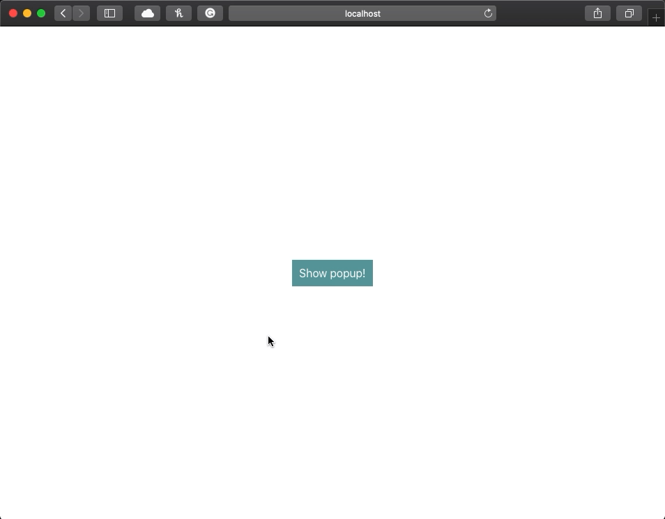

# React Animated Popup

A module to make elements become popups and animate in and out.

## Demo


Try the interactive demo [here.](https://3djakob.github.io/react-animated-popup-demo/)

## Installation

```sh
npm install --save react-animated-popup
```

## Usage

Import Popup and use the component like the snippet. Note that you will need to update your visibilty state on the `onClose` event.

If you want more usage help check out the demo repository code [here.](https://github.com/3DJakob/react-animated-popup-demo/blob/master/src/App.js)

```js
import Popup from 'react-animated-popup'

// ...

const [visible, setVisible] = useState(false)

return (
  <Popup visible={visible} onClose={() => setVisible(false)}>
    <p>I'm a popup!</p>
  </Popup>
)
```

## Props

### `children`

- optional
- type: `ReactNode`

Children to make up the popup.

### `visible`

- required
- type: `boolean`

Tha prompt state, make true to make the prompt appear.

### `onClose`

- required
- type: `CloseHandler`

Function called when closing. It is recommended to update your visible state to false on this callback.

### `animationDuration`

- optional
- type: `number`
- default: `100`

The duration of the animations in ms.

### `style`

- optional
- type: `CSSProperties`

Override styling to the popup div. Per default, it has a white background, rounded corners, and shadow. Everything can be overridden and it can be designed however you like!
